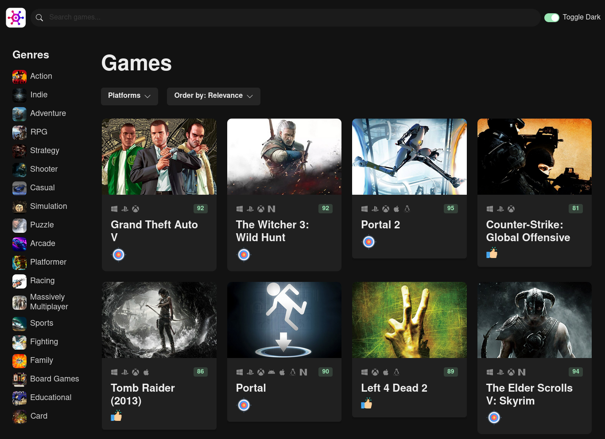

# GameHub: Your Ultimate Video Game Discovery Web App

GameHub is a sophisticated video game discovery web app that empowers gamers to find new and intriguing games to play. With GameHub, you can easily search for games by platform, genre, and other criteria. Developed using React with Vite.js and TypeScript, and styled with Chakra UI, GameHub provides a seamless user experience. The app utilizes React Query for efficient API calls, Zustand for state management and React Router for smooth navigation, all powered by the RAWG API.





## Live Demo

Check out the live demo of the GameHub: [GameHub Demo](https://game-7amz98fyi-radouane-oubakhane.vercel.app)


## Features

- **Intuitive Search**: Discover games by platform, genre, or specific keywords.
- **Comprehensive Information**: Access detailed game data including ratings, release dates, and descriptions.
- **Responsive Design**: Enjoy a seamless experience across various devices and screen sizes.
- **Efficient Data Management**: Utilizes React Query for optimized API fetching and Zustand for streamlined state management.


## Technologies Used

- **React**: A popular JavaScript library for building user interfaces.
- **Vite.js**: A fast, modern build tool that enhances the development experience.
- **TypeScript**: A superset of JavaScript that adds static types to the language.
- **Chakra UI**: A modular component library for React applications, offering a set of accessible and customizable UI components.
- **React Query**: A data-fetching and state management library for React applications.
- **Zustand**: A state management library for React applications, providing a simple and straightforward way to manage state without the need for complex abstractions.
- **React Router**: A standard library for routing and navigation in React applications.
- **RAWG API**: A comprehensive video game database providing rich metadata, ratings, and reviews.


## Getting Started

### Prerequisites

- **Node.js**: Make sure you have Node.js installed on your system. You can download it from [nodejs.org](https://nodejs.org/).

### Installation

1. **Clone the Repository**:

   ```bash
   git clone https://github.com/radouane-oubakhane/game-hub.git
   ```

2. **Change into the Project Directory**:
   ```bash
   cd game-hub
   ```

3. **Install Dependencies**:
   ```bash
   npm install
   # or
   yarn install
   ```


### Configuration
**RAWG API Key**: GameHub uses the [RAWG API](https://rawg.io/apidocs) to fetch game data. To get started, you need to create an account on RAWG and generate an API key. Once you have the API key, create a `.env` file in the root directory of the project and add the following line to it:
   ```bash
   VITE_RAWG_API_KEY=your-api-key
   ```
   Replace `your-api-key` with your actual API key.

### Running the App
**Start the Development Server**:

   ```bash
   npm run dev
   # or
   yarn dev
   ```
   
this will start the development server on [http://localhost:5173](http://localhost:5173).

### Building the App
**Build the App**:

   ```bash
   npm run build
   # or
   yarn build
   ```

this will build the app for production to the `dist` folder.

## Contributing
Contributions are welcome! Feel free to open an issue or submit a pull request.